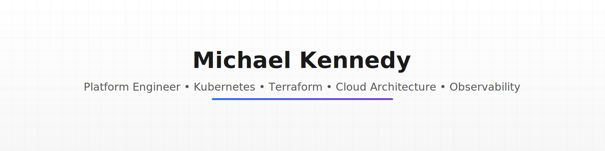

<picture>
  <source media="(prefers-color-scheme: dark)" srcset="assets/profile/profile-banner-dark.svg">
  <source media="(prefers-color-scheme: light)" srcset="assets/profile/profile-banner-light.svg">
  
</picture>

<h1 align="center">Michael Kennedy — Platform Engineer</h1>

    <strong>Kubernetes • Cloud Platforms • Terraform • Platform Observability • SRE</strong> 
    Building secure, observable, automated platforms across AWS, vSphere, and Proxmox.

---

## 🧩 Core Competencies
- **Kubernetes**: EKS, K3s, vSphere Tanzu, Proxmox + k3s clusters  
- **Infrastructure-as-Code**: Terraform, Helm, GitOps  
- **Platform Engineering**: NGINX KIC, service mesh patterns, secure ingress  
- **Observability**: OTEL, Metrics/Logs/Traces, end-to-end platform insights  
- **Cloud & Virtualisation**: AWS, vSphere, Proxmox  
- **Security**: Baseline hardening, policy-as-code, microservices posture  
- **Automation**: CI/CD, GitLab pipelines, semantic-release, IaC governance  

---

## 🚀 Featured Platform Repositories

### ### **1. platform-eks-nginx-kic**
Minimal, production-ready EKS platform with NGINX KIC, IAM, networking, and automated deployment.
<picture>
  <source media="(prefers-color-scheme: dark)" srcset="assets/platform-eks-nginx-kic-dark.png">
  
</picture>

### **2. vsphere-nginx-secure-appstack**
vSphere-hosted Kubernetes app stack with secure ingress, TLS, and policy baselines.

### **3. eks-policy-observability-stack**
Full OTEL-enabled observability pipeline with EKS, metrics/logs/traces, and rich dashboards.

### **4. platform-aws-microservices**
AWS-native microservices reference deployment (IaC-first).

### **5. platform-vmware-k3s-iac**
Automated VMware-hosted K3s cluster with full IaC deployment.

### **6. platform-proxmox-k3s-iac**
Proxmox-native K3s cluster automation (Terraform + cloud-init).

---

## 📚 Professional Identity
- Platform Engineer specialising in **secure, observable, cloud-native platforms**  
- Strong background in Kubernetes, distributed systems, and IaC automation  
- Obsessed with **clean architecture**, **repeatable environments**, **zero-to-prod automation**  
- Active builder of **open-source platform patterns**

---

## 🔧 Tooling & Tech Stack

**Languages:**  
`Go` · `Python` · `Bash` · `YAML`  

**Cloud & Runtime:**  
`AWS` · `Kubernetes` · `Proxmox` · `vSphere`  

**IaC & Automation:**  
`Terraform` · `Helm` · `Ansible` · `GitHub Actions` · `GitLab CI`  

**Ingress / Proxy / Networking:**  
`NGINX KIC` · `IngressLink patterns` · `LB controllers`

**Observability:**  
`OpenTelemetry` · `Grafana` · `Prometheus` · `Loki` · `Tempo`

---

## 🎓 Certifications
(To be updated with your Credly export)
- AWS  
- Kubernetes  
- Security  

Dark-mode badge pack included in asset bundle.

---

## 📫 Contact
- GitHub: **@merps**  
- LinkedIn: [merps](https://www.linkedin.com/in/merps/)  

---
